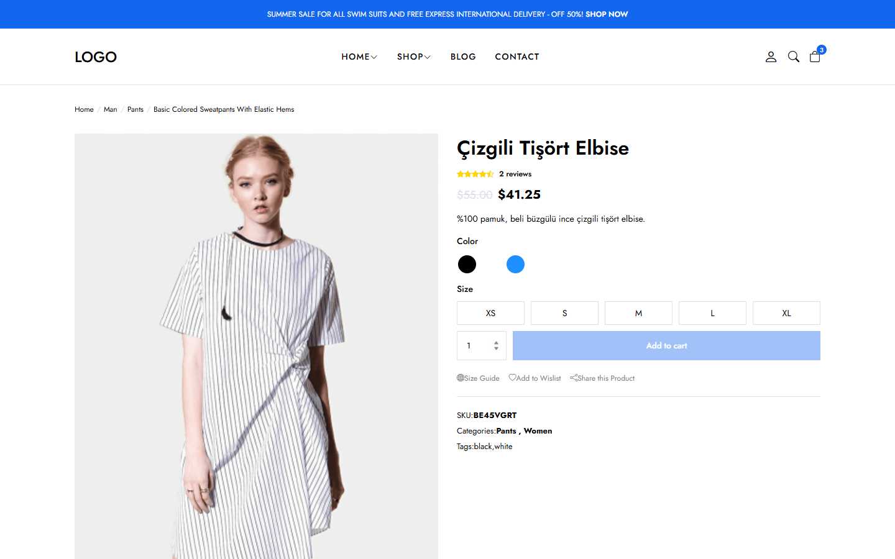
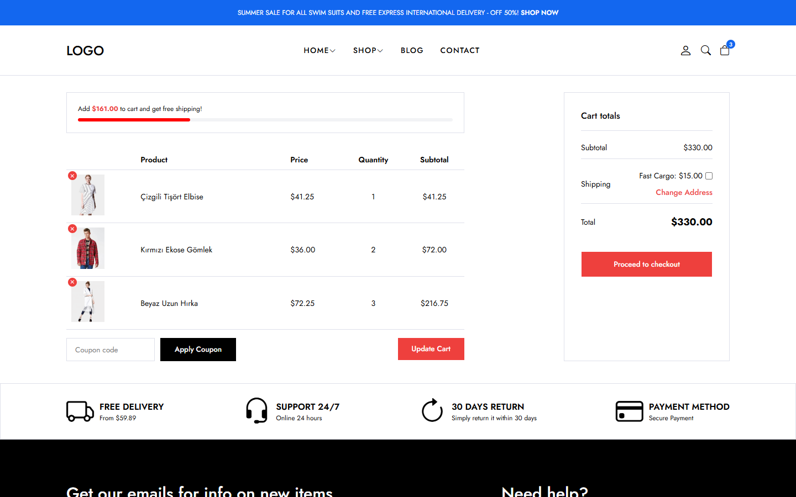
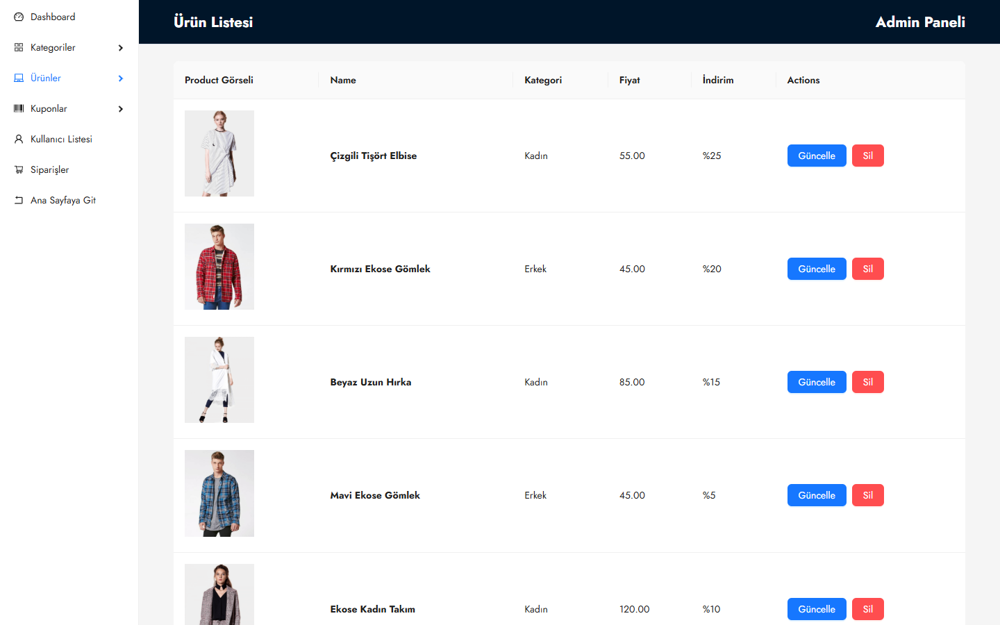
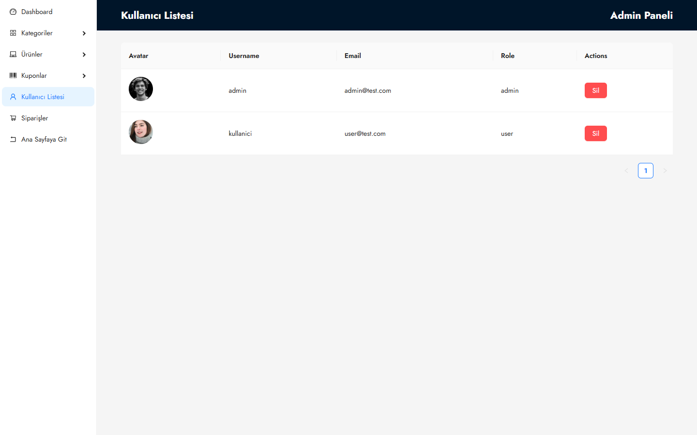

# E-Ticaret Sitesi (MERN)

MongoDB, Express, React ve Node.js ile geliştirilmiş, Stripe ödeme entegrasyonuna sahip tam kapsamlı bir e-ticaret uygulaması. Müşteriler ürünleri inceleyip sepete ekleyebilir, kupon kullanabilir ve kartla ödeme yapabilir; yöneticiler ise admin paneli üzerinden ürün, kategori, kupon, kullanıcı ve siparişleri yönetebilir.


## Özellikler

**Mağaza**
- Ürün listeleme, kategoriler ve ürün arama
- Ürün detay sayfası: görsel galerisi, renk/beden seçimi, indirimli fiyat
- Ürün yorumları ve puanlama (giriş yapmış kullanıcılar)
- Sepet yönetimi, kupon kodu ile indirim, hızlı kargo seçeneği
- Stripe Checkout ile güvenli ödeme
- Kullanıcı kaydı ve girişi
- Blog ve iletişim sayfaları

**Admin Paneli**
- Ürün, kategori ve kupon ekleme / güncelleme / silme
- Kullanıcıları listeleme ve silme
- Stripe üzerinden gelen siparişleri görüntüleme

## Ekran Görüntüleri

| Ürün Detayı | Sepet |
|---|---|
|  |  |

| Admin - Ürünler | Admin - Kullanıcılar |
|---|---|
|  |  |

## Kullanılan Teknolojiler

| Katman | Teknolojiler |
|---|---|
| Frontend | React 18, Vite, React Router, Ant Design, React Slick, React Quill |
| Backend | Node.js, Express |
| Veritabanı | MongoDB, Mongoose |
| Kimlik Doğrulama | JSON Web Token (JWT), bcrypt |
| Ödeme | Stripe Checkout |

## Güvenlik

- **JWT ile kimlik doğrulama:** Giriş yapan kullanıcıya imzalı bir token verilir; korumalı isteklerde bu token `Authorization: Bearer <token>` başlığıyla gönderilir.
- **Rol tabanlı yetkilendirme:** Ürün, kategori, kupon ve kullanıcı yönetimi işlemleri backend'de `verifyToken` ve `requireAdmin` middleware'leri ile yalnızca admin kullanıcılara açıktır.
- **Sunucu taraflı fiyat hesaplama:** Ödeme sırasında istemci yalnızca ürün kimliği ve adet gönderir; ürün fiyatı, ürün indirimi, kupon indirimi ve kargo ücreti sunucuda veritabanından hesaplanır. Böylece fiyatlar tarayıcıdan değiştirilemez.
- **Şifre güvenliği:** Şifreler bcrypt ile hash'lenerek saklanır ve hiçbir API cevabında yer almaz.
- **Gizli anahtarlar:** Stripe gizli anahtarı ve JWT anahtarı yalnızca backend'deki `.env` dosyasında tutulur, repoya eklenmez.

## Proje Yapısı

```
├── backend
│   ├── middleware/      # JWT doğrulama ve admin yetki kontrolü
│   ├── models/          # Mongoose şemaları (User, Product, Category, Coupon)
│   ├── routes/          # API rotaları
│   └── server.js        # Express sunucusu
└── frontend
    ├── public/img/      # Statik görseller
    └── src
        ├── components/  # Arayüz bileşenleri
        ├── context/     # Sepet state yönetimi (Context API)
        ├── layouts/     # Mağaza ve admin sayfa düzenleri
        └── pages/       # Sayfalar (mağaza + admin)
```

## Kurulum

### Gereksinimler
- [Node.js](https://nodejs.org/) 18 veya üzeri
- Bir MongoDB veritabanı ([MongoDB Atlas](https://www.mongodb.com/atlas) ücretsiz katmanı veya yerel kurulum)
- Bir [Stripe](https://stripe.com/) hesabı (test anahtarları yeterlidir)

### 1. Projeyi klonlayın
```bash
git clone https://github.com/Furkanrdmm/mern-e-ticaret.git
cd mern-e-ticaret
```

### 2. Backend
```bash
cd backend
npm install
```
`backend/.env.example` dosyasını `backend/.env` olarak kopyalayıp kendi değerlerinizi girin:

| Değişken | Açıklama |
|---|---|
| `MONGO_URI` | MongoDB bağlantı adresi |
| `CLIENT_DOMAIN` | Frontend adresi (ör. `http://localhost:5173`) |
| `STRIPE_SECRET_KEY` | Stripe gizli anahtarı (`sk_test_...`) |
| `JWT_SECRET` | Token imzalamak için uzun ve rastgele bir değer |

```bash
npm start
```
Sunucu `http://localhost:5000` adresinde çalışır.

### 3. Frontend
Yeni bir terminalde:
```bash
cd frontend
npm install
```
`frontend/.env.example` dosyasını `frontend/.env` olarak kopyalayın:

| Değişken | Açıklama |
|---|---|
| `VITE_API_BASE_URL` | Backend adresi (ör. `http://localhost:5000`) |
| `VITE_API_STRIPE_PUBLIC_KEY` | Stripe açık anahtarı (`pk_test_...`) |

```bash
npm run dev
```
Uygulama `http://localhost:5173` adresinde açılır.

### 4. Admin kullanıcısı oluşturma
Siteden normal şekilde kayıt olun, ardından MongoDB'de (Atlas arayüzü veya MongoDB Compass ile) `users` koleksiyonundaki kaydınızın `role` alanını `"admin"` olarak değiştirin. Tekrar giriş yaptığınızda admin paneline (`/admin`) yönlendirilirsiniz.

### Test ödemesi
Stripe test modunda `4242 4242 4242 4242` kart numarasını, gelecekteki herhangi bir son kullanma tarihini ve herhangi bir CVC kodunu kullanabilirsiniz.

## API

| Metot | Endpoint | Yetki | Açıklama |
|---|---|---|---|
| POST | `/api/auth/register` | Herkes | Kayıt olma |
| POST | `/api/auth/login` | Herkes | Giriş yapma, token döner |
| GET | `/api/products` | Herkes | Tüm ürünler |
| GET | `/api/products/:id` | Herkes | Tek ürün |
| POST | `/api/products/:id/reviews` | Kullanıcı | Ürüne yorum ekleme |
| POST · PUT · DELETE | `/api/products` | Admin | Ürün yönetimi |
| GET | `/api/categories` | Herkes | Tüm kategoriler |
| POST · PUT · DELETE | `/api/categories` | Admin | Kategori yönetimi |
| GET | `/api/coupons/code/:code` | Herkes | Kupon kodu doğrulama |
| GET · POST · PUT · DELETE | `/api/coupons` | Admin | Kupon yönetimi |
| GET · DELETE | `/api/users` | Admin | Kullanıcı yönetimi |
| POST | `/api/payment` | Kullanıcı | Stripe ödeme oturumu oluşturma |
| GET | `/api/payment/orders` | Admin | Siparişleri listeleme |
